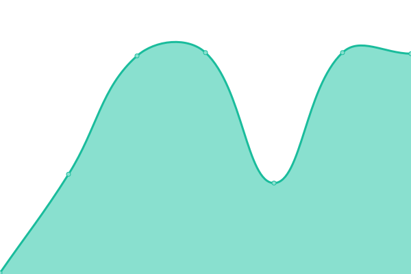

# [📈 Live Status](https://bluknight.github.io/skytalks-monitor): <!--live status--> **🟥 Complete outage**

This repository contains the open-source uptime monitor and status page for [bluknight](https://bluknight.github.io/skytalks-monitor), powered by [Upptime](https://github.com/upptime/upptime).

With [Upptime](https://upptime.js.org), you can get your own unlimited and free uptime monitor and status page, powered entirely by a GitHub repository. We use [Issues](https://github.com/bluknight/skytalks-monitor/issues) as incident reports, [Actions](https://github.com/bluknight/skytalks-monitor/actions) as uptime monitors, and [Pages](https://bluknight.github.io/skytalks-monitor) for the status page.

<!--start: status pages-->
<!-- This summary is generated by Upptime (https://github.com/upptime/upptime) -->
<!-- Do not edit this manually, your changes will be overwritten -->
<!-- prettier-ignore -->
| URL | Status | History | Response Time | Uptime |
| --- | ------ | ------- | ------------- | ------ |
|  [Skytalks SSL Website (v4)](https://skytalks.info) | 🟥 Down | [skytalks-ssl-website-v4.yml](https://github.com/bluknight/skytalks-monitor/commits/HEAD/history/skytalks-ssl-website-v4.yml) | 

 2075ms
     
 | 

<a href="https://bluknight.github.io/skytalks-monitor/history/skytalks-ssl-website-v4">69.35%</a>
    

|  [Skytalks SSL Website (v6)](https://skytalks.info) | 🟥 Down | [skytalks-ssl-website-v6.yml](https://github.com/bluknight/skytalks-monitor/commits/HEAD/history/skytalks-ssl-website-v6.yml) | 

 1244ms
     
 | 

<a href="https://bluknight.github.io/skytalks-monitor/history/skytalks-ssl-website-v6">76.50%</a>
    

<!--end: status pages-->

[**Visit our status website →**](https://bluknight.github.io/skytalks-monitor)

## 📄 License

- Powered by: [Upptime](https://github.com/upptime/upptime)
- Code: [MIT](./LICENSE) © [Anand Chowdhary](https://anandchowdhary.com), supported by [Pabio](https://pabio.com)
- Data in the `./history` directory: [Open Database License](https://opendatacommons.org/licenses/odbl/1-0/)
